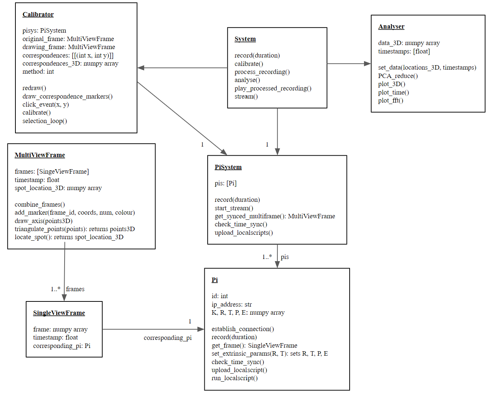
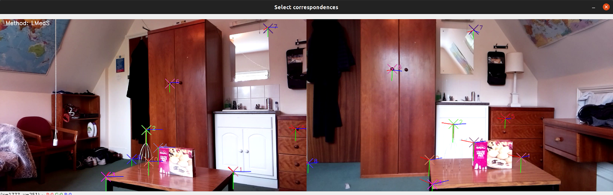
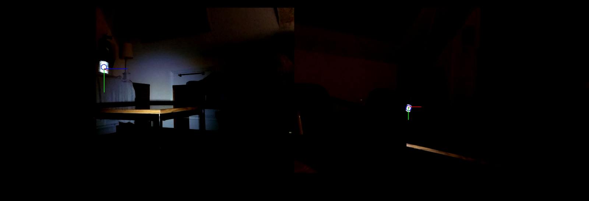
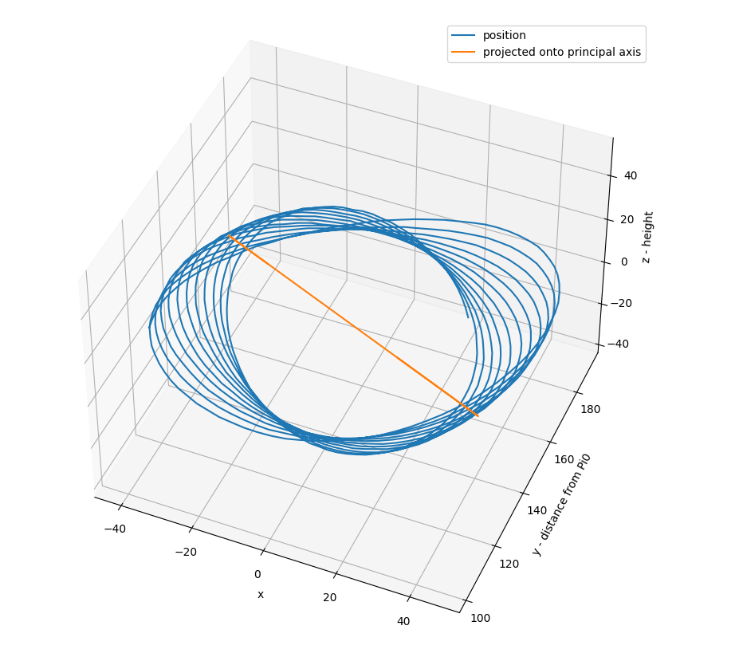

# IIB project: Raspberry Pi stereo camera tracking system
This repository contains a software system for tracking objects in 3D space using two Raspberry Pi 
computers with cameras, which connect to a server machine which performs the processing.

This software was developed as the primary component of my master's project, titled
*'Video Capture for a Tethered Balloon'*. The 
[full project report](https://drive.google.com/file/d/1bLLF8PPw0urBCYU0XQxHBJ_4LFz4ysKM/view?usp=sharing)
can be downloaded and read on my Google Drive.

The project was submitted on 2nd June 2021 for the degree of Master of Engineering 
at the University of Cambridge and was graded first class.

## Project technical abstract

This project details the development of a video capture system to track objects in 3D
space and perform a vibration analysis of their motion. The specific objective of the project
was to track the motion of a balloon on a tether, although specific tether detection methods
were not explored in detail and the system in its current state would be applicable to a wide
range of object tracking tasks.

The context for this study is the emerging interest in solar geoengineering - the
concept of injecting large quantities of radiation-reflecting particles into the stratosphere in
order to increase its albedo and cool the planet on a temporary basis. In the early 2010s the
SPICE project - Stratospheric Particle Injection for Climate Engineering - concluded that the
most practical delivery method for these aerosols on such a scale would be a high-altitude
tethered balloon on a 25km tether. Theoretical and simulation work has been performed to
predict the movement of such a long tether under various wind loading positions, however no
outdoor model was constructed. Therefore, the video capture system developed in this project
was intended to track the motion of a small or medium-scale model of a tethered balloon.

The system is intended to be low-cost, easily deployable in the field, and usable by a
researcher other than its creator. For this reason, Raspberry Pi computers were used, along
with Raspberry Pi Camera Modules. The Raspberry Pis are low-power and WiFi-enabled,
meaning they can be deployed wirelessly in the field, powered by a common phone charger
or battery. The Pis are synchronised using WiFi Direct and Network Time Protocol (NTP).
The Camera Module is capable of recording 1080p at 30FPS, or 922p at 30FPS if a wider
view angle of 62° is required. Vibrations of up to 15Hz are therefore theoretically able to be
measured.

Two Raspberry Pis with cameras are deployed in order to triangulate 3D position
using stereo vision theory. Several methods for calibration of the cameras are evaluated, and
one is chosen for development. The cameras are calibrated using manually indicated
correspondences in two views. The software is able to calculate the fundamental matrix,
recover the relative position of the two cameras, and provide visual feedback to the user
about the accuracy of the calibration while the user inputs the correspondence points. This
quickly led to an accurate calibration in experimental tests. Importantly, this method does not
require the use of a calibration object, which can be difficult to deploy in medium-scale field
tests.

In order to detect the tether in an image, two methods were considered: detection of
discrete markers placed on the tether, and continuous detection of the tether length. The
former was explored in this project, using retroreflective tape and LED light sources in order
to make the marker brighter than its surroundings in the image.

The software is written in Python and makes use of the open-source OpenCV library.
It is considered that a future researcher may wish to continue development on this software,
and for this reason it is written with readability, expandability and Pythonic design principles
in mind. The software is publicly available at github.com/bwharton97/IIB_project.

Experiments were carried out involving a hanging mass on a string. The system was
able to reliably detect the marker, track the mass in 3D space with low levels of noise, and
produce an interesting analysis of its motion using the techniques of PCA reduction and
Fourier Transform.

Future work is required to adapt the system to the specific task of tether detection.
Marker detection must be expanded to multiple markers, in order to recover the position of
the tether. The second method, of continuous tether detection without markers, could also be
explored, although in this case the task of tracking a fixed point on the tether through time is
rendered more difficult. Work to expand the system to use more than two Raspberry Pis
would potentially be very useful in order to increase triangulation accuracy and/or broaden
the scope of view of the system. Improvements could also be made to the synchronisation
accuracy of the system. With further development, a Raspberry Pi-based video capture
system shows good potential for tracking a tethered balloon.

## Software implementation

A major focus of this project was the custom software that was written for it. Rather
than being a means to an end, it was written to be compliant with modern concepts of good
software design, with particular emphasis on object orientation, expandability and readability.

### Object-orientation

As Python is primarily an object-oriented language, care was taken to comply with
this philosophy. To that end, the software was refactored several times, and it was found that
the resulting object-oriented code was much more efficient in terms of code lines and also the
number of variables passed as arguments to functions (because the arguments became
attributes of the class).

UML class diagram of the software, showing the main classes, their principal attributes and
methods, and their associations.

The figure shows the final software structure, following Universal Markup Language
conventions. The System class contains the high-level methods that may be called by main()
according to the wishes of the user. System initialises a PiSystem, which contains a collection
of Pi objects. PiSystem performs its methods on all its constituent Pis, sometimes
concurrently using multithreading. It also manages the task of synchronising its Pis. The
benefit of using a PiSystem is that the System does not need to know how many Pis are being
used.

The Pi class contains attributes for connecting to the Pis and also attributes relating
to the calibration of its camera. An important method is get_frame(), which returns a
SingleViewFrame from the Pi. The difference between ‘stream’ and ‘record’ modes is
handled at this abstraction level - higher levels are unaware of the difference. Each
SingleViewFrame contains an attribute linking back to the Pi that created it - this is essential
for triangulation.

In a similar way to the grouping of Pi objects in a PiSystem, SingleViewFrame
objects taken at the same instant in time are grouped within a MultiViewFrame. This contains
a method to merge the frames when they must be viewed, but otherwise the SingleViewFrame
objects are kept separate, as they have different corresponding_pi attributes and different
camera calibration parameters. MultiViewFrame also contains methods for object detection,
currently consisting of a method to detect a bright spot in the image.

The calibration stage is managed by the Calibrator class, which has attributes which
keep track of the correspondences inputted by the user and the currently displayed frame.
Whenever a user input is made, the redraw() method is called which restores a blank frame
and redraws markers for all the correspondences, attempts a calibration, and if successful
reprojects the basis vectors onto the image.

Lastly, the Analyser class contains all methods relating to the processing of the 3D
location data, such as Fourier transforms, PCA analysis and graph plotting.

### Expandability
The software was written such that it may be readily expanded. Such expansion
might include the addition of more Raspberry Pis, in order to cover a wider viewing area or
achieve more accurate triangulation. For this reason, all operations concerning the two Pis or
the two frames in a MultiViewFrame were written as loops over a list.

In order to incorporate additional Pis, the following modifications would be
necessary:
- MultiViewFrame.triangulate_points() would need to support multi-view (>2 views)
triangulation, methods for which are briefly discussed in the theory section. This is
not built-in to OpenCV, so would have to be manually implemented.
- MultiViewFrame.locate_spot() could be modified to allow an object to move out of
view. This would not be a problem when the object is still tracked by the other views.
It should be verified that any detection in a third view is consistent with the object
position in the other views.
- Calibrator should be modified to allow multi-way calibration. As the first Pi, Pi0, is
currently used as the basis for the coordinate system, a simple method would be to
ensure that all views share enough features with the view of Pi0 that 8
correspondences can be found, and then all Pis may be calibrated to Pi0 separately.
Simultaneous calibration could be attempted using multi-view triangulation, although
it is unclear to what extent an inaccurate fundamental matrix for a single Pi caused by
poorly inputted correspondences may prove hard to detect, potentially frustrating the
process. To widen the scope of view, additional Pis could alternatively be calibrated
compared to a reference Pi other than Pi0. This would require that the calculated R
and T be summed to the R and T of the reference Pi to obtain the position compared to
Pi0.

Further development would also be likely to involve the tracking of multiple points
simultaneously. This can be incorporated into the existing software structure, involving
modifications to MultiViewFrame.locate_spot() and the Analyser class.

## Experimental results

These images are repeated here for interest. For more details, please see
the full project report.

The user interface during calibration, giving feedback to the user about the calibration
points selected.

A screenshot of the processed video, a circle indicating the brightest point, and then
the red, green and blue basis vectors demonstrating that the software is aware of the 
object's position in 3D space. 

The estimated position of the object is recorded for the duration of the video and 
then plotted. The object is a mass on a pendulum following a circular path.

